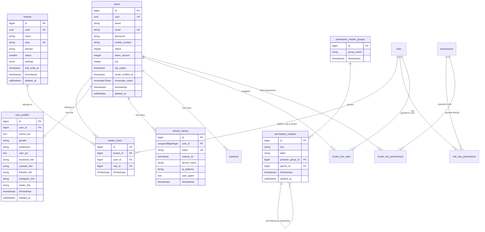

# Modular SaaS Database Relationship Schema Documentation

This document provides a comprehensive mapping of all database migrations, tables, columns, indexes, foreign keys, and their logical relationships in the multi-tenant SaaS modular application.

---

## 1. Entity-Relationship Diagram (ERD)

---

## 2. Table Specifications and Schema Details

### Core Multi-Tenancy

#### `tenants`
Stores independent SaaS tenant account workspaces.
* **`id`** (`bigint`, primary key): Auto-incrementing identifier.
* **`uuid`** (`uuid`, unique): String-based public identifier used for secure routing.
* **`name`** (`string(255)`): Business or account name of the tenant workspace.
* **`slug`** (`string(100)`, unique): Subdomain or URLslug used to scope requests.
* **`domain`** (`string`, nullable): Optional custom domain mapped to this tenant.
* **`status`** (`smallint`, default: `1`): Status state of the tenant (active, suspended).
* **`settings`** (`jsonb`, nullable): Schema-less configuration parameters for the tenant.
* **`trial_ends_at`** (`timestamp`, nullable): Expiration date of the tenant's free trial.
* **Indexes:** Unique index on `uuid`, unique index on `slug`.

#### `tenant_users`
Pivot table matching users to their associated tenants, with custom Spatie roles per tenant.
* **`id`** (`bigint`, primary key): Auto-incrementing pivot key.
* **`tenant_id`** (`bigint`, foreign key): References `tenants(id)`, cascade on delete.
* **`user_id`** (`bigint`, foreign key): References `users(id)`, cascade on delete.
* **`role_id`** (`bigint`, foreign key, nullable): References Spatie `roles(id)`, null on delete.
* **Indexes:** Unique composite index on `['tenant_id', 'user_id']`.

---

### Identity & Profiles

#### `users`
Core user credentials and security credentials.
* **`id`** (`bigint`, primary key): Auto-incrementing identifier.
* **`uuid`** (`uuid`, unique): Secure unique identifier.
* **`name`** (`string`): The user's full name.
* **`email`** (`string`, unique): Primary email address used for login.
* **`email_verified_at`** (`timestamp`, nullable): Email verification date.
* **`password`** (`string`): Hashed authentication password.
* **`mobile_number`** (`string(15)`, nullable): Contact mobile number.
* **`status`** (`integer`, default: `0`): Global account active status.
* **`token_version`** (`integer`, default: `0`): Version number used to globally invalidate JWT tokens on password change or logout.
* **`otp`** (`integer`, nullable): Single-use OTP code.
* **`otp_expiry`** (`timestamp`, nullable): Expiry timestamp for the active OTP.
* **Indexes:** Unique index on `uuid`, unique index on `email`.

#### `user_profiles`
Detailed profile metadata linked one-to-one with the user.
* **`id`** (`bigint`, primary key): Auto-incrementing profile key.
* **`user_id`** (`bigint`, foreign key, index): References `users(id)`.
* **`author_bio`** (`text`, nullable): Biographical user snippet.
* **`gender`** (`string(58)`, nullable): Stated user gender.
* **`profession`** (`string(58)`, nullable): Professional title.
* **`user_pic`** (`text`, nullable): Path or base64 data URL of profile image.
* **`facebook_link` / `youtube_link` / `linkedin_link` / `instagram_link` / `twitter_link`** (`string`, nullable): Social handles.
* **Indexes:** Foreign key index on `user_id`.

---

### Sessions & Access Tokens

#### `refresh_tokens`
Long-lived secure tokens utilized to securely rotate short-lived JWT access tokens.
* **`id`** (`bigint`, primary key).
* **`user_id`** (`unsignedBigInteger`, index): References `users(id)`.
* **`token`** (`string`, unique, index): Randomized token sequence.
* **`expires_at`** (`timestamp`): Token expiration threshold.
* **`device_name` / `ip_address` / `user_agent`** (`string`, nullable): Session context details.

#### `sessions`
Database-backed standard Laravel session persistence.
* **`id`** (`string`, primary key): Session token identifier.
* **`user_id`** (`bigint`, nullable, index): Linked authenticated user ID.
* **`ip_address`** (`string(45)`, nullable): Session IP address.
* **`user_agent`** (`text`, nullable): Browser agent fingerprint.
* **`payload`** (`longText`): Serialized session attributes.
* **`last_activity`** (`integer`, index): Unix timestamp of last active request.

---

### Master Hierarchical Permissions

#### `permission_master_groups`
Provides high-level grouping containers for custom permissions.
* **`id`** (`bigint`, primary key).
* **`group_name`** (`string(54)`, default: `'web'`).

#### `permission_masters`
Hierarchical, recursive master permissions definition catalog.
* **`id`** (`bigint`, primary key).
* **`key`** (`string`): Unique programming key (e.g., `'users.create'`).
* **`label`** (`string`): Human-readable permission label (e.g., `'Create User'`).
* **`pmaster_group_id`** (`bigint`, foreign key, index): References `permission_master_groups(id)`.
* **`parent_id`** (`bigint`, nullable, index): Self-references `permission_masters(id)` to construct permission trees.

---

### Spatie Permissions Tables
Dynamic, polymorphic role and permission mapping tables (standard Spatie model):
* **`permissions`**: Standard Spatie permissions catalog.
* **`roles`**: Standard Spatie roles catalog (team-enabled).
* **`model_has_permissions`**: Polymorphic pivot matching direct permissions to models.
* **`model_has_roles`**: Polymorphic pivot matching roles directly to models.
* **`role_has_permissions`**: Pivot matching roles to their active allowed permissions list.
